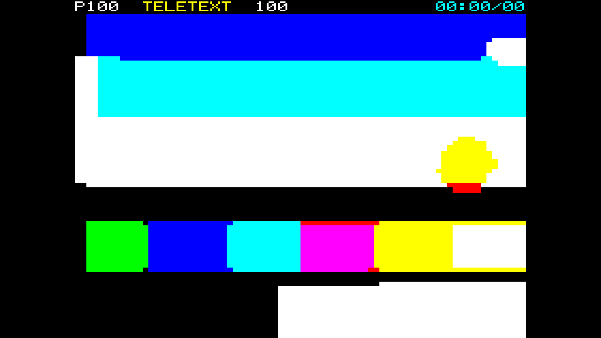

# teletext

> **AI-assisted project.** This codebase was created with [Claude](https://claude.com/claude-code)
> (Anthropic), directed and reviewed by a human author. The teletext is not
> asserted but measured: an offline harness drives the real plugin class in a
> headless GL context and reads each claim back — the row encoder's cost equals an
> exhaustive search exactly on 24 random rows, a colour boundary costs exactly one
> cell of black and a background change exactly two, every one of 921,600 output
> pixels is one of eight colours and every sixel is uniform, the separated gutter
> is where the SAA5050 puts it to the pixel, each row shows the frame of the field
> that carried it through a resize, and a single-bit error blanks its cell while a
> double-bit error corrupts it and neither moves a row — with nine negative
> controls that prove each check can fail. It has **never been loaded into
> Resolume on macOS**; the only host it has met there is
> [oxbow](https://github.com/stoatworks-labs/oxbow), which is a real FFGL host and
> is not Resolume. On Windows it has run in Resolume Arena 7.27.1, on software
> rendering. See [Status](#status).

A picture sent as Level 1 teletext mosaic graphics, as an FFGL effect for
[Resolume](https://resolume.com) Arena and Avenue.



<sub>One frame, rendered by `txtest`, the offline harness — not captured from
Resolume. The test card at the defaults: 4:3, Hold Graphics on, four rows a field.</sub>

## The one idea

A teletext page is 40 columns by 24 rows of character cells. A cell is a character,
or a **2×3 mosaic** of sixels in the current foreground colour over the current
background. There are eight colours. And colour is **not stored per cell**: it is
set by a control code in the row that changes the colour from that cell onwards, and
**the control code itself occupies a cell**, which shows as background — a space —
unless Hold Graphics is on. A new background takes two codes. Every row starts white
on black, in alphanumerics.

So a teletext encoder is an optimiser under a hard serial constraint. This plugin runs
the clip through an exactly optimal one — a Viterbi programme per row over the
decoder's own state — and the look falls out of the constraint rather than being
drawn:

- **The gap.** Every change of foreground colour costs a cell of background, so
  colour boundaries sit on a column of black blocks. Column 0 of every row with a
  mosaic in it is a code, because a row starts in alphanumerics.
- **Colour is rationed.** You cannot change colour in adjacent cells; a new
  background costs two; and where the encoder may move the background it finds the
  trick teletext artists found — a solid boundary that costs three code cells and no
  black at all, because each code shows the background it is changing to.
- **Eight colours and 80×72 sixels**, and nothing between. A mid-tone is whichever
  of the eight is nearest, in RGB or weighted by luma.
- **Hold Graphics** fills the code cells with the last mosaic instead of a space,
  and its own bleed falls out: the held shape is drawn in whatever colours are in
  effect at that cell.
- **The page arrives as it is transmitted**: a few rows a field, in row order,
  cycling, so a moving picture updates row by row and tears between rows.
- **Bit errors** land the teletext way. Character bytes are odd-parity, so a
  single-bit error is caught and blanks the cell (and a broken colour code loses its
  colour for the rest of the row); a double-bit error passes as the wrong mosaic; and
  the row address is Hamming-protected, so an error never moves a row.

### What is drawn, and what is not

The decoder (`source/Decoder.cpp`) is the receiver's half of the standard, and it is
the reference for everything: the encoder is judged by what the decoder makes of its
bytes, and the render pass draws exactly the cells the decoder produces on the
SAA5050's 6×10-dot cell — blocks of 3×3, 3×4 and 3×3 dots, contiguous or separated
(each block losing its left column and bottom line), scaled up by whole pixels where
the frame allows.

The header row is a real row 0: page number, a service name, the page again and a
running clock, in alphanumerics with their own colour codes, drawn from a 5×7 bitmap
font of our own. No broadcaster's name appears anywhere.

### The honest limit

Hold Graphics is approximate. Under Hold a code cell shows the last mosaic
*received*, which depends on the path through the row and not on the programme's
state; the programme costs a held cell as if the previous cell were a mosaic placed
under the state's own colours, which is exact in the common case of a colour change
between two runs. Both programmes are run, with and without Hold, each byte string is
decoded for what it actually shows, and the cheaper is kept — so the result with Hold
on is never worse than the exact optimum without it. `txtest --optimal` measures both
bounds. Alphanumeric characters are used only for the header; the encoder draws with
mosaics alone, and Level 1 only — no double height, no flash, no boxes.

## Controls

| Group | |
| --- | --- |
| **Encoder** | Error Space (RGB, Luma Weighted), Hold Graphics, Allow Background, Separated. |
| **Transmission** | Rows per Field (1–24), Signal Quality (1 clean; below it, bit errors at 0.3 × (1 − q)² of transmitted bytes), Freeze (hold the page, like the Hold key). |
| **Display** | Grid Fit (4:3 safe area centred, or Fill), Header, Page Number (100–899), Show Codes (a diagnostic: control cells tinted), Mix. |

The defaults are RGB error, Hold Graphics on, backgrounds allowed, contiguous
mosaics, four rows a field (a page every six fields, 0.12 s), a clean signal, the 4:3
safe area with the header on page 100.

## Status

**v0.1.0 — 24 September 2026.** The first release: a universal macOS bundle and a
Windows x64 DLL, with a [user guide](https://stoatworks-labs.com/software/teletext/guide/)
and a [browser demo](https://teletext-demo.stoatworks-labs.com/).

### Measured offline, on macOS

`tools/verify.sh` passes on this machine (M4 Max, macOS 26.4) against a fresh
universal Release build, running every picture check at **two rasters**, 320×180
and 1280×720. What it establishes, in numbers:

| check | result |
| --- | --- |
| `--optimal` | on 24 random rows of 3–8 cells (half the sixels pure palette colours, half arbitrary), in both error spaces, the programme's realised cost **equals** an exhaustive search over every control placement, exactly, in integers; with Hold on the realised cost is never above the hold-off optimum and never below the exhaustive search with Hold in its alphabet (gap **0** on every row); the one-cell-lookahead greedy encoder is worse on 12 of the 24 |
| `--gap` | a red-then-blue row, foreground only: control cells at exactly **{0, 20}**, every other cell a full mosaic of the right colour, the boundary cell black on the picture; red then blue-on-red: exactly **{0, 18, 19}** — New Background then the colour; red then blue with backgrounds allowed: **0** of the row's pixels off the target colour — the boundary is free |
| `--palette` | **0** of 921,600 pixels (57,600 at 320×180) off the eight colours in four renders (both grid fits, contiguous and separated), **0** pixels in a non-uniform sixel, 8 colours seen |
| `--separated` | on 912 full white mosaic cells per render, **0** of 656,640 / 820,800 pixels (4:3 / Fill at 1280×720) disagree with the stated gutter, and every cell has exactly 28 × kx × ky white pixels; at 320×180 (fractional scale) 0 of 27,360 / 36,480 |
| `--carriage` | at 60 fps for 17 frames, 5 rows a field, all **24** rows show the frame the harness's own field arithmetic predicts, identically through a resize to another raster halfway; at 24 fps (two or three fields a frame) likewise |
| `--parity` | a forced single-bit error: parity fails, **all** the cell's pixels are its background, **0** pixels change outside the cell; a forced double-bit error: parity passes, the mosaic changes (0x60 → 0x63), 0 pixels off the palette, 0 change outside the cell; at Signal Quality 0.3, 124 of 960 cells fail parity and 0 pixels leave the palette |
| `--negative` | nine perturbed models — a greedy encoder, codes that take no cell, the sixel mean instead of a colour, Show Codes on, the gutter on the other side, every row every field, a decoder that ignores parity, a double error on one bit twice, errors that move rows — each **fails** its check |
| mutation | one character of the shipped GLSL (the middle sixel row ending at line 6 instead of 7) was caught by `--palette` at both rasters (207 non-uniform pixels at 320×180), then reverted |
| `tools/sweep.py` | all **12** controls measurably change the picture, at 320×180 and 480×270 |
| shaders | all 3, as the plugin assembles them, compile through `glslc` |
| `--pipe` | 2.5 frames in, exactly 2 out; an unknown cue refused (exit 2); a closed stdout exits 1, not SIGPIPE |
| the bundle | universal (`x86_64 arm64`), exports `plugMain`, ad-hoc signs; `oxbow` reports `SW Teletext` / `TX01` / `effect` and renders 120 frames through `plugMain` |

Render cost at the defaults, best of three runs of 60 frames after a warm-up,
`glFinish` both sides, on a GPU and CPU shared with other builds (the `verify.sh`
run): **0.67 ms** at 720p, **0.86 ms** at 1080p, **1.42 ms** at 1440p, **2.98 ms**
at 4K. The figure includes the 80×72 read-back (the one stall) and the CPU encoder
for the rows each field carries; with all 24 rows a field it was 1.8–4.9 ms in a
separate, noisier run. macOS figures only.

### Not established

It has **never been loaded into Resolume on macOS.** Everything above was compiled,
rendered and measured offline against the real plugin class in a headless CGL context,
plus an `oxbow` load. What the host's clock does to the field counter over a long
session, and whether the read-back stall is felt on a busy composition, are untested.
On Windows it has: a build of v0.1.0 loads, registers and renders in Resolume Arena 7.27.1 on software rendering (win-lab, Mesa llvmpipe, no GPU, 2026-09-24), with all 18 host controls matching the declaration, and Arena's log stays clean: 8 of the fleet Arena gate's 9 checks, in two runs. The ninth, controls, read Rows per Field and Freeze dead both times, because the gate holds a still picture: a still page comes round in under a second at any Rows per Field, and a frozen still is the same still; `--carriage` measures the first and the sweep the second. Software rendering says nothing about a GPU or about speed.
The look has been seen on the synthetic test card and, through the harness's `--pipe`,
on Resolume's bundled demo clips for the project video: eight colours and nothing
between means a dark clip loses its mid-tones to black, so the guide says to lift a
dark clip with a brightness effect ahead of this one. The separated gutter follows
jsbeeb's reading of the SAA5050, not the datasheet figure. No OpenFX port, no presets.
There is a [user guide](https://stoatworks-labs.com/software/teletext/guide/). The
[browser demo](https://teletext-demo.stoatworks-labs.com/) runs the plugin's own
shaders and reads the sixel means back as the plugin does, but its CPU half — the
encoder, the transmission and the decoder — is a hand port to JavaScript, and nothing
checks a port but a reader.

## Build

Needs CMake 3.15+, a C++17 compiler, and the FFGL SDK submodule.

```bash
git clone --recursive https://github.com/stoatworks-labs/teletext
cd teletext
cmake -B build -DCMAKE_BUILD_TYPE=Release
cmake --build build --parallel
cmake --install build     # into ~/Documents/Resolume Arena/Extra Effects
```

macOS builds are universal (Apple Silicon + Intel) by default; add
`-DCMAKE_OSX_ARCHITECTURES=arm64` for a faster dev build. Windows needs GLEW via vcpkg.

## Building and testing

The offline harness renders the real plugin class headlessly, on a synthetic 60 fps
clock:

```bash
./build/txtest --out /tmp/frame.png --size 1920x1080   # the test card
./build/txtest --list                                  # every control, kind and default
./build/txtest --optimal                               # the encoder against an exhaustive search
./build/txtest --gap --palette --separated             # each claim, measured on the picture
./build/txtest --carriage --parity
./build/txtest --negative                              # and the checks can fail
./build/txtest --bench                                 # 720p through 4K
python3 tools/sweep.py                                 # no control is silently dead
python3 demo/tools/check_shaders.py                    # the browser demo's shaders are the plugin's
tools/verify.sh                                        # all of it, on a fresh universal build
```

Every check takes `--size`; run it at 320×180 as well as the raster you care about.
Footage goes through the real plugin with `--pipe`, in the fleet's frame format:

```bash
ffmpeg -i in.mov -f rawvideo -pix_fmt rgba - \
  | ./build/txtest --pipe --size 1920x1080 --script cues.txt \
  | ffmpeg -f rawvideo -pix_fmt rgba -s 1920x1080 -i - out.mov
```

See [`CLAUDE.md`](CLAUDE.md) for the full command reference and
[`AGENTS.md`](AGENTS.md) for the model and the traps.

<!-- attributions:start -->
This project is built on other people's work — see [ATTRIBUTIONS.md](ATTRIBUTIONS.md).
<!-- attributions:end -->

## Licence

MIT — see [LICENSE](LICENSE).
